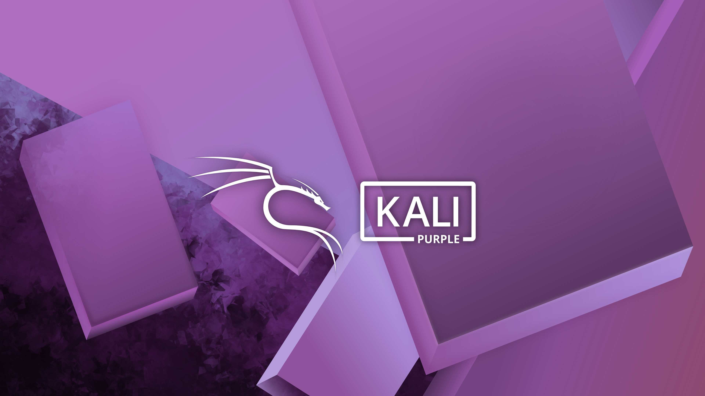

<p align="center">
  
</p>

<h1 align="center">CYBERSECURITY</h1>
<p align="center">Blue Team | Purple Team | Red Team | SOC Analyst | Network | Incident | Monitoring</p>

### Professional Technical Portfolio | Long-Term Engineering Repository

## Overview

Este repositorio representa un dominio especializado dentro de mi portafolio técnico profesional, enfocado en la implementación, administración, monitoreo, análisis y protección de infraestructuras tecnológicas mediante prácticas, metodologías y soluciones de ciberseguridad utilizadas en entornos empresariales.

Su contenido documenta la aplicación práctica de conocimientos mediante laboratorios, proyectos, documentación técnica y escenarios reales relacionados con la protección de sistemas, redes, plataformas Cloud e infraestructuras híbridas.

---

## Purpose

El propósito de este repositorio es desarrollar competencias profesionales relacionadas con la ingeniería de ciberseguridad, fortaleciendo habilidades técnicas en protección, monitoreo, análisis, automatización y respuesta ante incidentes de seguridad.

Los principales objetivos incluyen:

- Documentar soluciones técnicas.
- Desarrollar laboratorios prácticos.
- Implementar proyectos empresariales.
- Aplicar buenas prácticas de seguridad.
- Automatizar tareas relacionadas con la ciberseguridad.
- Construir evidencia técnica del aprendizaje continuo.

---

## Scope

Este repositorio comprende el estudio, documentación y desarrollo práctico de tecnologías relacionadas con la ciberseguridad, defensa de infraestructuras, protección de sistemas, análisis de amenazas, seguridad ofensiva y defensiva, respuesta a incidentes y aplicación de controles de seguridad utilizados en entornos empresariales.

El alcance del proyecto incluye los siguientes dominios tecnológicos:

---

### Security Fundamentals

Fundamentos de ciberseguridad utilizados como base para la protección de infraestructuras empresariales.

Áreas principales:

- CIA Triad
- Risk Management
- Security Principles
- Security Controls
- Governance
- Compliance
- Security Policies
- Security Frameworks

---

### Network Security

Protección de redes empresariales y dispositivos de comunicación.

Áreas principales:

- Firewalls
- IDS / IPS
- VPN
- Network Segmentation
- Secure Network Design
- Traffic Analysis
- Network Hardening
- Zero Trust

---

### Endpoint Security

Protección de estaciones de trabajo, servidores y dispositivos finales.

Áreas principales:

- Endpoint Protection
- Antivirus
- EDR
- Device Hardening
- Patch Management
- Application Control
- Disk Encryption

---

### Identity & Access Management

Administración de identidades y control de acceso.

Áreas principales:

- Authentication
- Authorization
- Multi-Factor Authentication (MFA)
- Privileged Access Management (PAM)
- Role-Based Access Control (RBAC)
- Single Sign-On (SSO)
- Identity Governance

---

### Defensive Security

Implementación de controles defensivos para la protección de infraestructuras.

Áreas principales:

- Blue Team Operations
- Hardening
- Security Baselines
- Log Analysis
- Threat Detection
- Incident Prevention
- Security Monitoring

---

### Vulnerability Management

Identificación, evaluación y remediación de vulnerabilidades.

Áreas principales:

- Vulnerability Assessment
- Vulnerability Scanning
- Risk Prioritization
- Patch Validation
- Remediation
- Reporting

---

### Incident Response

Gestión y respuesta ante incidentes de seguridad.

Áreas principales:

- Incident Handling
- Digital Evidence
- Containment
- Eradication
- Recovery
- Lessons Learned

---

### Security Monitoring

Monitoreo continuo de eventos relacionados con la seguridad.

Áreas principales:

- SIEM
- Log Management
- Alerting
- Event Correlation
- Threat Hunting
- Security Dashboards

---

### Penetration Testing

Evaluación controlada de la seguridad mediante pruebas de penetración.

Áreas principales:

- Reconnaissance
- Enumeration
- Exploitation
- Privilege Escalation
- Post Exploitation
- Reporting

---

### Digital Forensics

Investigación y análisis forense digital.

Áreas principales:

- Evidence Collection
- Disk Analysis
- Memory Analysis
- Timeline Analysis
- Artifact Analysis
- Reporting

---

### Malware Analysis

Análisis de software malicioso y técnicas utilizadas por amenazas.

Áreas principales:

- Static Analysis
- Dynamic Analysis
- Behavioral Analysis
- Indicators of Compromise (IOC)
- Reverse Engineering Fundamentals

---

### Cloud Security

Implementación de controles de seguridad para plataformas Cloud.

Áreas principales:

- Azure Security
- AWS Security
- Identity Protection
- Cloud Security Controls
- Compliance
- Cloud Monitoring

---

### Application Security

Seguridad aplicada al desarrollo e implementación de aplicaciones.

Áreas principales:

- Secure Coding
- OWASP Top 10
- API Security
- Dependency Management
- Secrets Management
- Application Hardening

---

## Out of Scope

Los siguientes dominios tecnológicos mantienen repositorios independientes:

- Linux Administration → Linux Engineering
- Microsoft Technologies → Microsoft Engineering
- Infrastructure Technologies → Infrastructure Engineering
- Database Technologies → Database Engineering
- Python → Python Engineering
- Cloud Technologies → Cloud Engineering

## Repository Architecture

La estructura del repositorio está organizada por dominios tecnológicos.

Cada dominio mantiene de forma independiente su documentación, laboratorios, proyectos, recursos y rutas de aprendizaje.

```text
cybersecurity-engineering/

├── security-fundamentals/
├── governance-risk-compliance/
├── identity-access-management/
├── network-security/
├── endpoint-security/
├── linux-security/
├── windows-security/
├── cloud-security/
├── application-security/
├── cryptography/
├── vulnerability-management/
├── security-monitoring/
├── threat-intelligence/
├── incident-response/
├── digital-forensics/
├── blue-team/
├── red-team/
├── security-automation/
├── compliance/
└── troubleshooting/
```

---

## Technical Domains

### Domain Name

Descripción del dominio y su importancia dentro del ecosistema tecnológico.

Incluye:

- Tecnologías principales.
- Herramientas utilizadas.
- Casos de uso.
- Aplicaciones empresariales.

## Labs

Los laboratorios documentarán escenarios prácticos relacionados con protección, monitoreo, automatización, análisis y administración de plataformas seguras.

Cada laboratorio incluirá:

- Objetivo
- Requisitos
- Procedimiento
- Evidencia
- Resultados
- Lecciones aprendidas

### Example

```text
labs/
│
├── lab-01-name/
├── lab-02-name/
└── lab-03-name/
```

---

## Projects

Los proyectos estarán orientados a implementar soluciones de ciberseguridad utilizadas en escenarios empresariales.

Ejemplos:

- Hardening de infraestructura.
- Implementación de SIEM.
- Automatización de seguridad.
- Monitoreo empresarial.
- Respuesta ante incidentes.
- Arquitecturas seguras.

---

## Learning Paths

Cada dominio tecnológico mantiene sus propias rutas de aprendizaje y certificaciones.

Ejemplos:

```text
security-fundamentals/

└── learning-paths/

    CompTIA Security+

    ISC² Certified in Cybersecurity

    CISSP

    Curso Completo de Ciberseguridad Defensiva

security-monitoring/

└── learning-paths/

    Cisco SOC Analyst

cloud-security/

└── learning-paths/

    SC-100

    SC-200

    SC-300

network-security/

└── learning-paths/

    Fortinet
```

---

## Documentation Standards

Toda la documentación seguirá principios de:

- Claridad técnica.
- Organización consistente.
- Evidencia práctica.
- Reproducibilidad.
- Referencias oficiales.
- Mejora continua.

---

## Roadmap

### Phase 1 — Security Foundations

- Fundamentos de seguridad.
- Redes.
- Sistemas.
- Criptografía.

### Phase 2 — Infrastructure Security

- Linux Security.
- Windows Security.
- Network Security.
- Cloud Security.

### Phase 3 — Security Operations

- Security Monitoring.
- Threat Intelligence.
- Incident Response.
- Vulnerability Management.

### Phase 4 — Enterprise Security

- Automatización.
- Arquitecturas seguras.
- Gobierno.
- Cumplimiento.
- Proyectos empresariales.

---

## Lessons Learned

Esta sección documenta:

- Problemas encontrados.
- Errores cometidos.
- Soluciones aplicadas.
- Mejoras realizadas.
- Conocimientos adquiridos.

---

## Repository Status

**Status:** Active Development

Este repositorio se encuentra en construcción continua como parte de un proceso de aprendizaje y desarrollo profesional.

---

## References

Fuentes utilizadas:

- Documentación oficial.
- Libros técnicos.
- Estándares de industria.
- Cursos especializados.
- Laboratorios prácticos.

---

## Core Principles

Este repositorio sigue los siguientes principios:

- Continuous Learning.
- Documentation First.
- Practical Experience.
- Technical Excellence.
- Continuous Improvement.
- Knowledge Organization.

## Professional Vision

Cada laboratorio, proyecto y documento representa una etapa del proceso de crecimiento técnico, manteniendo como principios fundamentales la práctica constante, la documentación estructurada y la mejora continua.

Más que un repositorio de estudio, este proyecto constituye una base de conocimiento en evolución permanente, orientada a reflejar el desarrollo progresivo de habilidades de ingeniería y la aplicación de buenas prácticas de la industria.

> **Building knowledge through practice, documentation and continuous improvement.**


